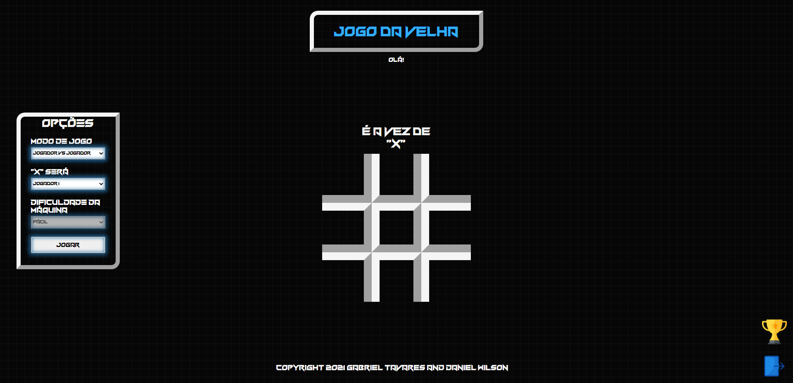

# JOGO-DA-VELHA

Site created for the didactic purpose of the PWFE classes of the Systems Development course at [SENAI Jandira] (https://jandira.sp.senai.br/), about teacher orientation [Fernando Leonid] (https: // github .com / fernandoleonid)

The project consists in the creation of a tic-tac-toe game, with the inclusion of bots and their due difficulties. The project also registers the player, and increases their scores in the player ranking.

The code was created with best practices in mind, such as sole responsibility and pure roles.

